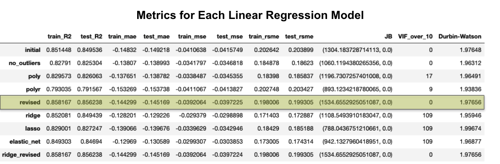
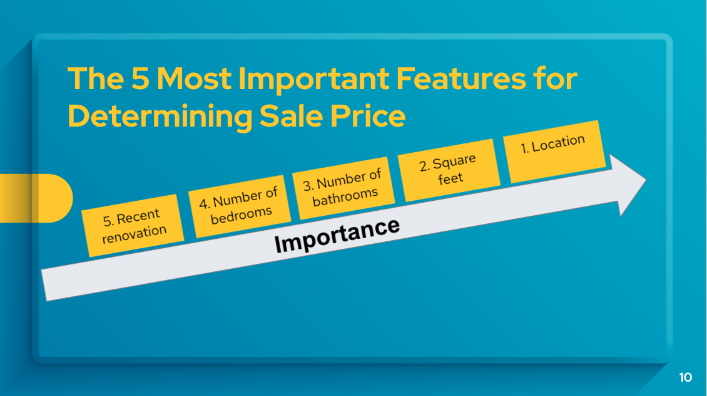
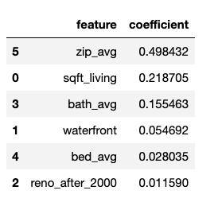
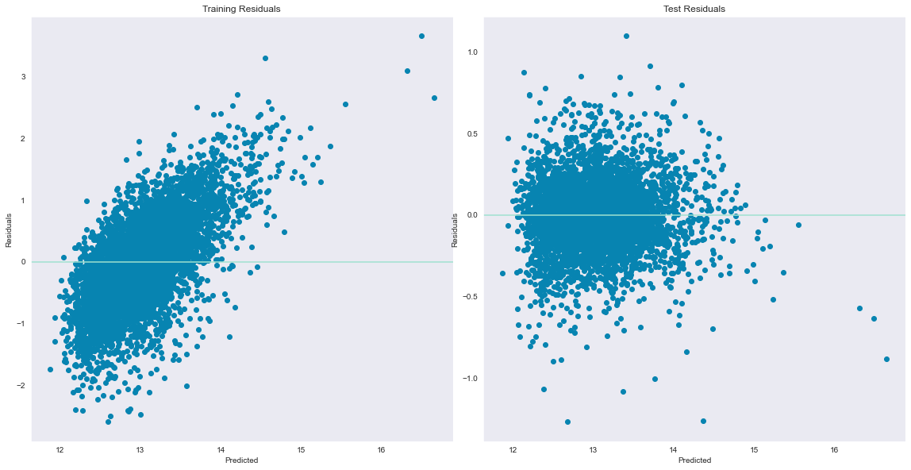
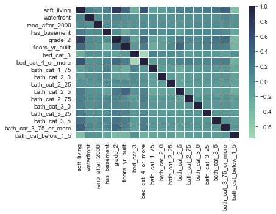
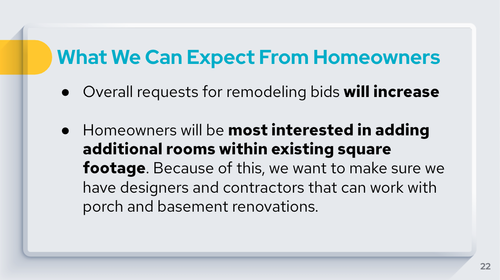

# Improving Premium Remodeling's Sales Funnel With Value-Added Predictions


## Business Problem


Premium Remodeling is a company based in King County, WA that specializes in additions and the creation of new rooms. Their target market is the more than 16,000 homeowners whose homes are older than twenty years and have not had a renovation since 2000. Their goal is to convince homeowners to complete an addition and/or add a bedroom or bathroom within their existing square footage.


## Business Value

In conversation, it is learned that the online design tool they have on their website receives quite of bit of traffic, but that potential customers leave once they receive a price estimate for the remodeling project.


According to Premium Remodeling, their average bathroom addition costs \\$11,800 and adding 400 square feet to a home has an average cost of \\$65,000. Because this is such a major investment, homeowners will be more likely to proceed with a remodeling project if they know how it will increase the predicted sale price for their home. This analysis will allow homeowners to see the current predicted sale price for their home as well as the predicted sale price if they add a bathroom, bedroom and/or square footage to their existing home. By seeing the value of the remodeling project, homeowners will be more likely to hire Premium Remodeling to complete the work.

In addition, information from this analysis will provide information for Premium Remodeling on which areas to target advertising based on where homeowners are more likely to have older homes that have not been recently remodeled or home with fewer bedrooms and/or bathrooms than average.


## Questions to Consider

- When and why are potential customers leaving the website?
- How does the addition of a bathroom, bedroom and/or square footage increase the predicted sales price of a particular house, all other factors held constant?


## Methodology


Data from over 20,000 home sales in King County were analyzed to first determine which home features are most correlated with sales price. Based on the visualizations of the data and the correlations, several features were selected to focus on and the data were transformed into the correct formats for regression.

Nine different models were created and their metrics were evaluated for how well the model described the data, the error rate, signs of overfitting or multicollinearity and any conflicts with the assumptions of linear regression.

Finally, the most effective model was selected and a pipeline was created in order to use the model to predict the sales price of newly provided home data.


## Feature Selection and Engineering


The target value of sale price was log transformed because the distribution had a significant right skew. 


The features for basement square footage and renovation year were converted into binary values (has a basement and renovation after 2000, respectively). Missing values for waterfront were replaced with 0 (the mode and also under the assumption that if no information was provided, the house is most likely not on the water). Grade, condition, bathrooms and bedrooms were transformed into categorical features, where each category could capture a range of values. 


## Modeling

Before standardizing the numerical data and one-hot-encoding the categorical features, the data were split into training and testing sets in order to avoid data leakage.

Five models were created using ordinary least squares: 

- The initial model used features that were highly correlated with the target and independent of each other. 
- The model with outliers removed used the same features as the previous models, but removed the top 2.5% and bottom 2.5% of the data in order to reduce the number of outliers and improve the normality of the residuals.
- The third model used Sci-kit Learn's PolynomialFeature to expand the features up to the second degree.
- The fourth model the used recursive feature elimination of the polynomial model in order to select the most significant features.
- Finally, the revised model used the information gained from the others to select the features and feature interactions that performed the best.

Four models were created using regularization. For each one, grid search was used in order to determine the best value for the hyperparameter(s). All but the last of these were trained on all selected features with the outliers removed.

- Ridge regression
- Lasso regression
- Elastic net regression
- The final model used the same features as the revised OLS model and applied ridge regression.


## Model Selection and Validation

The revised model using ordinary least squares is selected because it has a high R^2 value, no problems with multicollinearity and a reasonable error rate. 






Based upon the coefficients in the model, the following conclusions can be reached:
- Location matters. Because this is the largest coefficient, this single feature has the most impact on the predicted sale price of a home. Waterfront, which is also a component of location, is also important (increases price by 5%).
- The square footage of the home is the second most important feature. For each 900 square feet (1 standard deviation), the price is expected to increase by 22%.
- The next most important feature is the number of bathrooms, with an average coefficient of 0.16. This means that, on average, increasing from less than 1.5 bathrooms increases the predicted sales price of the home by 16%.
- Other features that are important to the model are the grade of the materials used in the home and number of bedrooms.

For the categorical variables of zip code, bathrooms and bedrooms, the average coefficients of the categories are listed in the table. In the actual model, these vary based upon the category. 




More specifically, according to the coefficients in this model, 
- Adding approximately 900 square feet (1 standard deviation) is expected to increase the sale price of the house by 21-23%, all other features held constant.
- Adding a 2nd bathroom is expected to increase the sale price by 2-5%.
- Adding a 3rd bedroom is expected to increase the sale price by 2-4%.
- Doing a remodel (assuming one has not been done since 2000) is expected to increase the sale price by 0.8 and 1.5%

The mean absolute error for the model is .145. This means that the model tends to be 14.5% off the actual price. Based on the model using unscaled data and an un-transformed price target, the model tends to be off of the actual price by around $96,000.

Because this model is used to show the change the change in predicted sale price after renovations and the underestimation will be proportional on the original and renovated homes, this error is acceptable with this model.


### Linear Assumptions

#### Linear Relationships

The selected features have a linear relationship with the target.


#### Normal Distribution of Residuals

While not perfectly normal due to leptokurtosis (the residuals are clustered around 0), the residuals are not skewed and the qq-plots look quite good for the majority of the data.


#### Homoscedasticity

The Durbin-Watson score of 1.98 is between 1.5 and 2.5, which indicates that the residuals are homoscedastic. This can also be seen on the scatter plots, where there is no fanning or pattern. 




#### Feature Independence

No VIF scores are above 10, which shows reasonable independence between variables. This is also confirmed with the correlations shown in the heatmap. 



## Pipeline Creation for Future Predictions

A pipeline was created that takes in information about an existing home (square footage, year built, number of bedrooms, number of bathrooms, waterfront, renovated and zip code) and returns the predicted sales price after the addition of square footage, a bathroom and/or a bedroom.


## Conclusions and Recommendations

The current website design should be updated to request current house information from users and include the price predictions from the linear regression model to show homeowners the personalized return on investment they can expect to gain if they move forward with the renovation. If homeowners are able to see how increasing their square footage or rooms can increase the value of their home, they are more likely to be willing to spend the money on the renovation.


Even though adding additional square footage has the most impact on the predicted sales price, because of the cost of construction, it does not have the greatest return on investment.

The greatest ROI comes from adding additional bedrooms and bathrooms within existing square footage. Once this price prediction tool is deployed, Premium Remodeling can expect to see an increase in homeowners wanting to add these features to their homes.



## Future Work


-This model was built using data from 2014 and 2015, which is obviously outdated. Newer data needs to be obtained, which may require updating the model. Ideally, new data would be batch processed every month or so in order to be able to capture trends in the industry.

-In this project, zip code was used as a proxy for location. Ideally, this would be replaced with metrics about distance to schools, parks, highways, major employers, etc.

-Once the model is updated, it will need to be deployed on the website. This will require the assistance of a website designer.


```python

```
